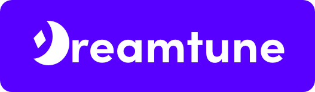

# DreamTune

DreamTune is a company founded in the Music Copyright industry and is dedicated to streamlining the process of music payment. By integrating into our customer's POS system and tracking relevant information, we aim to become the seamless solution for businesses to pay royalties quickly and easily. [Demo Video](https://drive.google.com/drive/u/0/folders/1BdKA-Ltrz7zCSLbTkAVe-CuxQRkCO79t)

## Application

You can view our production [application hosted here](https://dreamtune-cdf8a.web.app/auth/login). See our [README.md in the app folder](https://github.com/dcsil/dream-team/tree/master/app) to read more about our app. 

## How our Team Works
We are using issues as the main way to delegate tasks. We are also using the projects tabs and milestones to help organize this information. Communication will happen mainly over our private slack channel. Some of our internal documents will be hosted on Google Drive, but as needed we will convert them to markdown and upload to GitHub. 

Table of Contents.
---

- [People](./team/)
- [Diversity](./team/diversity.md)
- [Product & Research](./product_research/)
    - [Market](./product_research/market.md)
    - [Roadmap](./product_research/roadmap.md)
